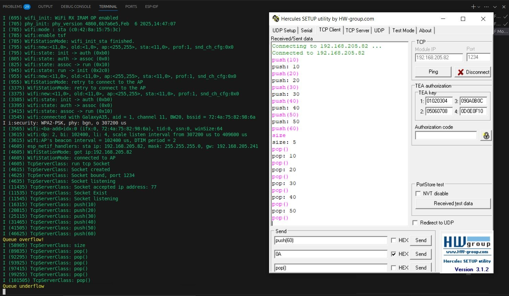

### Multi-Threaded Element Queue Component Esp32
In this project the device is in station mode and try to connect to the Wi-Fi router. 
`CustomQueue` is used to manage data that is received from TCP cliend. 

### Configuration
* To connect the device to specific router, set `ROUTER_SSID`, `ROUTER_PASS`.<br>
* Maximum Queue capacity is set by `MAX_QUEUE_SIZE` and the default is `5`.<br>
* tcp socket port is set by `TCP_PORT`. The default is `1234`.<br>

### Usage
* `push(n)` to enqueue new data.<br>
* `pop()` to dequeue first input.<br>
* `size` to get the current size of the queue.<br>

### Project Structure:
```
├── build
├── CMakeLists.txt
├── dependencies.lock
├── images
├── main
├── managed_components
├── pytest_blink.py
├── README.md
├── sdkconfig
└── sdkconfig.old
```

### Dependencies
* ESP-IDF<br>
* C++<br>  

### Example
